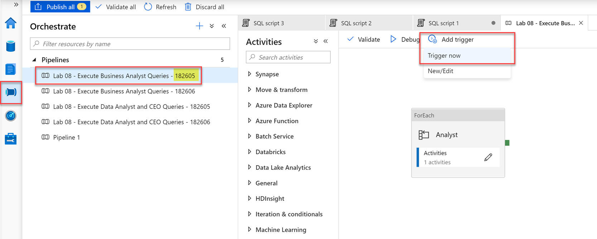
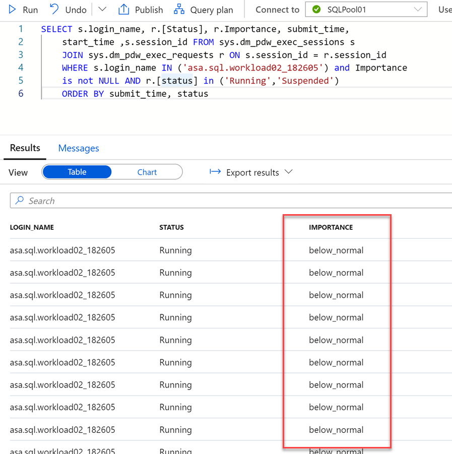
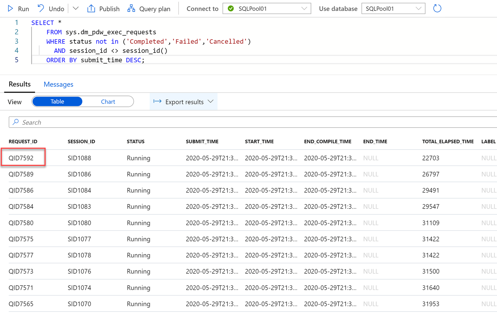
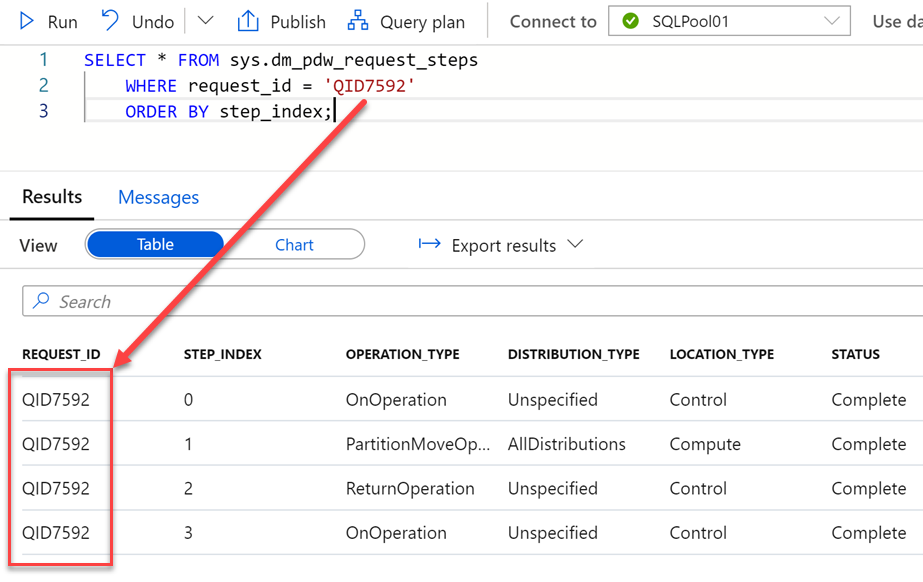
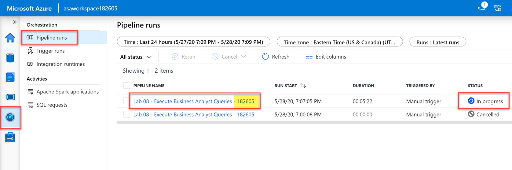
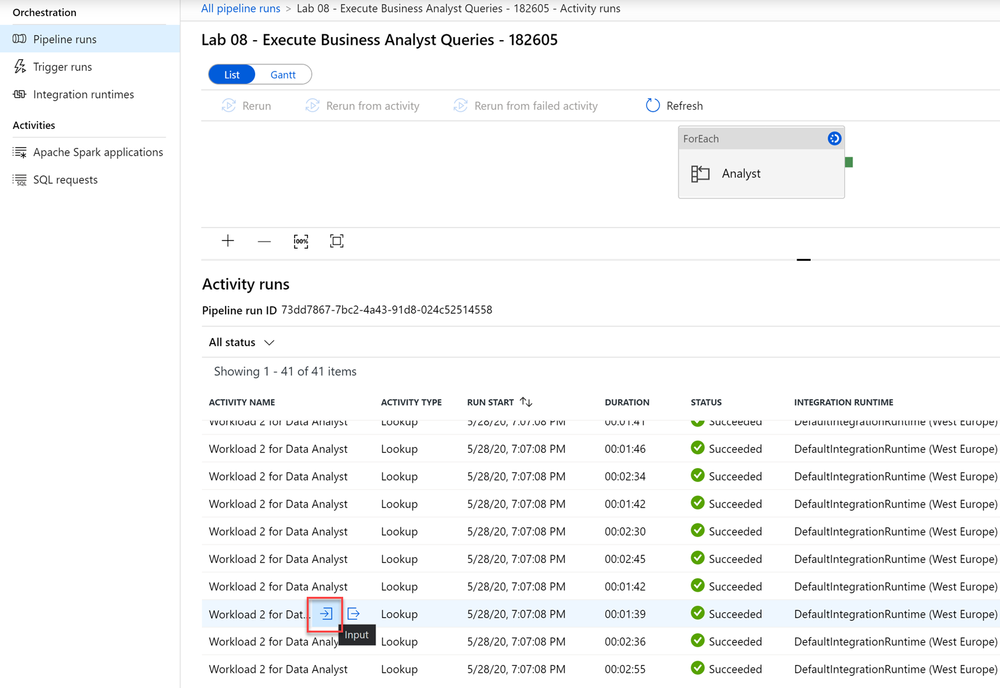
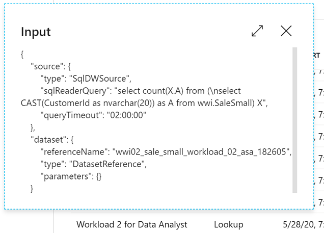
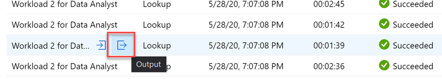
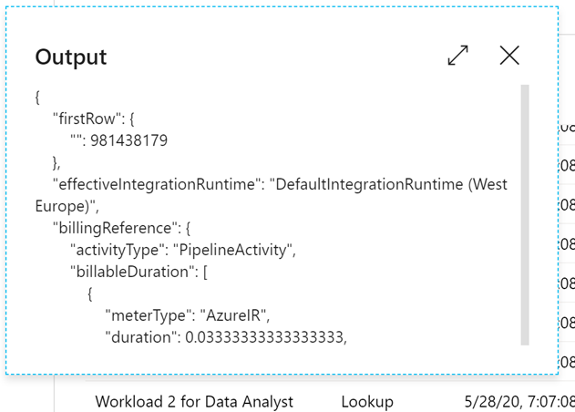
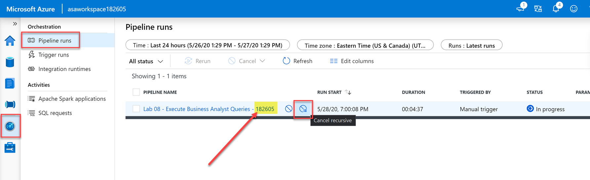

# Monitoring

Azure Synapse Analytics provides a rich monitoring experience within the Azure portal to surface insights regarding your data warehouse workload. The Azure portal is the recommended tool when monitoring your data warehouse as it provides configurable retention periods, alerts, recommendations, and customizable charts and dashboards for metrics and logs. The portal also enables you to integrate with other Azure monitoring services such as Azure Monitor (logs) with Log analytics to provide a holistic monitoring experience for not only your data warehouse but also your entire Azure analytics platform for an integrated monitoring experience.

You can monitor active SQL requests using the SQL requests area of the Monitor Hub. This includes details like the pool, submitter, duration, queued duration, workload group assigned, importance, and the request content.

Pipeline runs can be monitored using the Monitor Hub and selecting Pipeline runs. Here you can filter pipeline runs and drill in to view the activity runs associated with the pipeline run and monitor the running of in-progress pipelines.

The execution of Spark applications representing the execution of notebooks and jobs can be monitored within the Monitor Hub, selecting Spark applications. Selecting a Spark application to view its progress and to launch the Spark UI to examine a running Spark job and stage details, or the Spark history server to examine a completed application.

## Exercise 1 - Workload Management

Running mixed workloads can pose resource challenges on busy systems. Solution Architects seek ways to separate classic data warehousing activities (such as loading, transforming, and querying data) to ensure that enough resources exist to hit SLAs.

Synapse SQL pool workload management in Azure Synapse consists of three high-level concepts: Workload Classification, Workload Importance, and Workload Isolation. These capabilities give you more control over how your workload utilizes system resources.

Workload importance influences the order in which a request gets access to resources. On a busy system, a request with higher importance has first access to resources. Importance can also ensure ordered access to locks.

Workload isolation reserves resources for a workload group. Resources reserved in a workload group are held exclusively for that workload group to ensure execution. Workload groups also allow you to define the amount of resources that are assigned per request, much like resource classes do. Workload groups give you the ability to reserve or cap the amount of resources a set of requests can consume. Finally, workload groups are a mechanism to apply rules, such as query timeout, to requests.

### Task 1 - Workload Importance

Often in a data warehouse scenario you have users who need their queries to run quickly. The user could be executives of the company who need to run reports or the user could be an analyst running an adhoc query.

Setting importance in Synapse SQL for Azure Synapse allows you to influence the scheduling of queries. Queries with higher importance will be scheduled to run before queries with lower importance. To assign importance to queries, you need to create a workload classifier.

> **Important note:** Throughout the labs, you will be asked to replace `SUFFIX` with your student ID value. This ensures unique names for any artifacts you create, in case you are sharing a Synapse Analytics workspace with others. Your student ID is the set of numbers at the end of your assigned username. For example, if your username is `odl_user_104871`, your student ID is `104871`.

1. Open Synapse Analytics Studio (<https://web.azuresynapse.net/>), and then navigate to the **Develop** hub.

    

2. From the **Develop** menu, select the + button and choose **SQL Script** from the context menu.

    

3. In the toolbar menu, connect to the **SQL Pool** database to execute the query.

    

4. We will give our `asa.sql.workload01` user queries priority by implementing the **Workload Importance** feature. Also, we set the [dynamic resource class](https://docs.microsoft.com/azure/synapse-analytics/sql-data-warehouse/resource-classes-for-workload-management#dynamic-resource-classes) value to `mediumrc`. In the query window, replace the script with the following (where `SUFFIX` is your **student ID** - there are **4 SUFFIX instances** to replace):

    ```sql
    IF EXISTS (SELECT * FROM sys.workload_management_workload_classifiers WHERE name = 'CEO_SUFFIX')
    BEGIN
        DROP WORKLOAD CLASSIFIER CEO_SUFFIX;
    END
    CREATE WORKLOAD CLASSIFIER CEO_SUFFIX
      WITH (WORKLOAD_GROUP = 'mediumrc'
      ,MEMBERNAME = 'asa.sql.workload01_SUFFIX',IMPORTANCE = High);
    ```

5. Select **Run** from the toolbar menu to execute the SQL command.

### Task 2 - Workload Isolation

Workload isolation means resources are reserved, exclusively, for a workload group. Workload groups are containers for a set of requests and are the basis for how workload management, including workload isolation, is configured on a system. A simple workload management configuration can manage data loads and user queries.

In the absence of workload isolation, requests operate in the shared pool of resources. Access to resources in the shared pool is not guaranteed and is assigned on an importance basis.

Configuring workload isolation should be done with caution as the resources are allocated to the workload group even if there are no active requests in the workload group. Over-configuring isolation can lead to diminished overall system utilization.

Users should avoid a workload management solution that configures 100% workload isolation: 100% isolation is achieved when the sum of `min_percentage_resource` configured across all workload groups equals 100%. This type of configuration is overly restrictive and rigid, leaving little room for resource requests that are accidentally misclassified. There is a provision to allow one request to execute from workload groups not configured for isolation.

1. In the query window, replace the script with the following to set 3.25% minimum resources and BELOW_NORMAL importance to incoming requests (where `SUFFIX` is your **student ID** - there are **5 SUFFIX instances** to replace):

    ```sql
    IF NOT EXISTS (SELECT * FROM sys.workload_management_workload_classifiers where group_name = 'CEODemo_SUFFIX')
    BEGIN
        --- Creates a workload group 'CEODemo'.
        Create  WORKLOAD GROUP CEODemo_SUFFIX WITH  
            (MIN_PERCENTAGE_RESOURCE = 26 -- integer value
                ,REQUEST_MIN_RESOURCE_GRANT_PERCENT = 3.25 -- factor of 26 (guaranteed more than 4 concurrencies)
            ,CAP_PERCENTAGE_RESOURCE = 100)
        --- Creates a workload Classifier 'CEODreamDemo'.
        Create Workload Classifier CEODreamDemo_SUFFIX with
            (Workload_Group ='CEODemo_SUFFIX',MemberName='asa.sql.workload02_SUFFIX',IMPORTANCE = BELOW_NORMAL);
    END
    ```

    > **Note**: Configuring workload containment implicitly defines a maximum level of concurrency. With a CAP_PERCENTAGE_RESOURCE set to 60% and a REQUEST_MIN_RESOURCE_GRANT_PERCENT set to 1%, up to a 60-concurrency level is allowed for the workload group. Consider the method included below for determining the maximum concurrency:
    > 
    > [Max Concurrency] = [CAP_PERCENTAGE_RESOURCE] / [REQUEST_MIN_RESOURCE_GRANT_PERCENT]

2. Let's flood the system with SQL requests and see what happens for `asa.sql.workload02`. To do this, we will run an Azure Synapse Pipeline which triggers queries. Select the **Orchestrate** Tab. **Run** the **Lab 08 - Execute Business Analyst Queries - SUFFIX** Pipeline (where `SUFFIX` is your **student ID**), which will run / trigger `asa.sql.workload02` queries.

    

3. In the query window, replace the script with the following to see what happened to all of the `asa.sql.workload02` queries we just triggered as they flood the system (where `SUFFIX` is your **student ID**):

    ```sql
    SELECT s.login_name, r.[Status], r.Importance, submit_time,
    start_time ,s.session_id FROM sys.dm_pdw_exec_sessions s
    JOIN sys.dm_pdw_exec_requests r ON s.session_id = r.session_id
    WHERE s.login_name IN ('asa.sql.workload02_SUFFIX') and Importance
    is not NULL AND r.[status] in ('Running','Suspended')
    ORDER BY submit_time, status
    ```

4. Select **Run** from the toolbar menu to execute the SQL command.

    Your results should show several sessions running with `below_normal` importance.

    

## Exercise 1 - Workload Monitoring

Azure Synapse Analytics provides a rich monitoring experience within the Azure portal to surface insights regarding your data warehouse workload. The Azure portal is the recommended tool when monitoring your data warehouse as it provides configurable retention periods, alerts, recommendations, and customizable charts and dashboards for metrics and logs. The portal also enables you to integrate with other Azure monitoring services such as Azure Monitor (logs) with Log analytics to provide a holistic monitoring experience for not only your data warehouse but also your entire Azure analytics platform for an integrated monitoring experience. 

For a programmatic experience when monitoring SQL Analytics via T-SQL, the service provides a set of Dynamic Management Views (DMVs). These views are useful when actively troubleshooting and identifying performance bottlenecks with your workload.

### Task 1 - Monitoring with Dynamic Management Views

All logins to your data warehouse are logged to `sys.dm_pdw_exec_sessions`. This DMV contains the last 10,000 logins. The `session_id` is the primary key and is assigned sequentially for each new logon.

1. In the query window, replace the script with the following:

    ```sql
    SELECT * FROM sys.dm_pdw_exec_sessions where status <> 'Closed' and session_id <> session_id();
    ```

    All queries executed on SQL pool are logged to `sys.dm_pdw_exec_requests`. This DMV contains the last 10,000 queries executed. The `request_id` uniquely identifies each query and is the primary key for this DMV. The `request_id` is assigned sequentially for each new query and is prefixed with `QID`, which stands for query ID. Querying this DMV for a given `session_id` shows all queries for a given logon.

2. Select **Run** from the toolbar menu to execute the SQL command.

3. In the query window, replace the script with the following:

    ```sql
    SELECT *
    FROM sys.dm_pdw_exec_requests
    WHERE status not in ('Completed','Failed','Cancelled')
      AND session_id <> session_id()
    ORDER BY submit_time DESC;
    ```

4. Select **Run** from the toolbar menu to execute the SQL command. You should see a list of sessions in the query results similar to the following. **Note the `Request_ID` of a query** in the results that you would like to investigate (*keep this value in a text editor for a later step*):

    

5. As an alternative, you can execute the following SQL command to find the top 10 longest running queries.

    ```sql
    SELECT TOP 10 *
    FROM sys.dm_pdw_exec_requests
    ORDER BY total_elapsed_time DESC;
    ```

6. To simplify the lookup of a query in the `sys.dm_pdw_exec_requests` table, use `LABEL` to assign a comment to your query, which can be looked up in the `sys.dm_pdw_exec_requests` view. To test using the labels, replace the script in the query window with the following (where `SUFFIX` is your **student ID**):

    ```sql
    SELECT *
    FROM sys.tables
    OPTION (LABEL = 'My Query SUFFIX');
    ```

7. Select **Run** from the toolbar menu to execute the SQL command.

8. In the query window, replace the script with the following to filter the results with the label, `My Query SUFFIX` (where `SUFFIX` is your **student ID**).

    ```sql
    -- Find a query with the Label 'My Query'
    -- Use brackets when querying the label column, as it it a key word
    SELECT  *
    FROM sys.dm_pdw_exec_requests
    WHERE [label] = 'My Query SUFFIX';
    ```

9. Select **Run** from the toolbar menu to execute the SQL command. You should see the previously run query in the results view.

10. In the query window, replace the script with the following to retrieve the query's distributed SQL (DSQL) plan from `sys.dm_pdw_request_steps`. **Be sure to replace** the `QID#####` with the `Request_ID` you noted in **Step 4**:

    ```sql
    SELECT * FROM sys.dm_pdw_request_steps
    WHERE request_id = 'QID####'
    ORDER BY step_index;
    ```

11. Select **Run** from the toolbar menu to execute the SQL command. You should see results showing the distributed query plan steps for the specified request:

    

    > When a DSQL plan is taking longer than expected, the cause can be a complex plan with many DSQL steps or just one step taking a long time. If the plan is many steps with several move operations, consider optimizing your table distributions to reduce data movement.

### Task 2 - Orchestration Monitoring with the Monitor Hub

1. Navigate to the **Monitor** hub. Then select **Pipeline runs** to get a list of pipelines that ran during the last 24 hours. Observe the Pipeline status. **Select** the pipeline that is either in-progress or completed, named **Lab 08 - Execute Business Analyst Queries - SUFFIX** (where `SUFFIX` is your **student ID**).

    

2. Scroll down the list of activity runs until you find one whose status is **Succeeded**. Hover over the **Workload 2 for Data Analyst** activity name, then select the **Input** link.

    

3. Observe the input details to view the SQL query and the dataset used by the activity.

    

4. Close the input dialog. Hover over the **Workload 2 for Data Analyst** activity name, then select the **Output** link.

    

5. Observe the output details to view the SQL query result, the Integration Runtime used, and billable duration of the pipeline activity.

    

6. Navigate back to the pipeline runs, hover over the pipeline (with your student ID), and select **Cancel recursive** to cancel the execution of the current instance of the pipeline.

    

### Task 3 - Monitoring SQL Requests with the Monitor Hub

1. Navigate to the **Monitor** hub. Then select **SQL requests** to get a list of SQL requests that ran during the last 24 hours.

2. Select the **Pool** filter and select your SQL Pool. Observe the `Request Submitter`, `Submit Time`, `Duration`, and `Queued Duration` values.

    

3. Hover onto a SQL Request log and select `Request Content` to access the actual T-SQL command executed as part of the SQL Request.

    

## Resources

- [Workload Group Isolation (Preview)](https://docs.microsoft.com/azure/synapse-analytics/sql-data-warehouse/sql-data-warehouse-workload-isolation)
- [Workload Isolation](https://docs.microsoft.com/azure/synapse-analytics/sql-data-warehouse/sql-data-warehouse-workload-isolation)
- [Workload Importance](https://docs.microsoft.com/azure/synapse-analytics/sql-data-warehouse/sql-data-warehouse-workload-importance)
- [Workload Classification](https://docs.microsoft.com/azure/synapse-analytics/sql-data-warehouse/sql-data-warehouse-workload-classification)
- [Monitoring workload using DMVs](https://docs.microsoft.com/azure/synapse-analytics/sql-data-warehouse/sql-data-warehouse-manage-monitor)